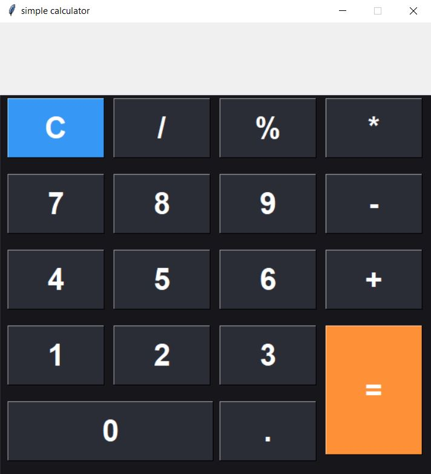

# Simple calculator using Python Tkinter

This project is one of my first programming projects, and it has been a really fun and educational experience for me.
I created a simple calculator using **Python** and **Tkinter**, which supports basic arithmetic operations such as addition, subtraction, multiplication, division, and modulus(remainder calculation).

-------

## Features
- GUI made with **Tkinter**
- Supports basic math operations:
  - Addition (+)
  - Subtraction (-)
  - Multiplication (*)
  - Division (/)
  - Modulus (%) for remainder (example: "3 % 2")
- Propper error handling (for example, division by zero displays an error message instead of crashing)
- Begginer-friendly clean and readable code

-------

## What i learned 
Working on this project helped me improve my undrestanding of: 
- Tkinter GUI basics
- Event handling and button functions
- Arithmetic logic in python
- Handling errors such as division by zero
- Organizing code in a clean and readable way

-------

## Technologies used
- **Python**
- **Tkinter GUI Library**

-------

-------

## Author
**Fatemeh**
*Python & AI learner*

